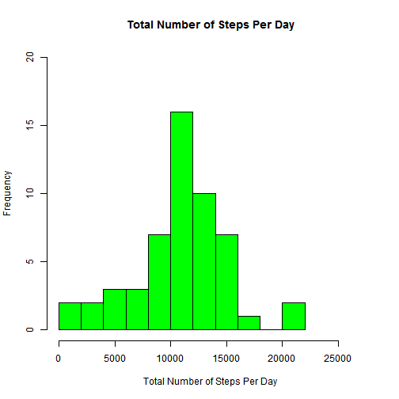
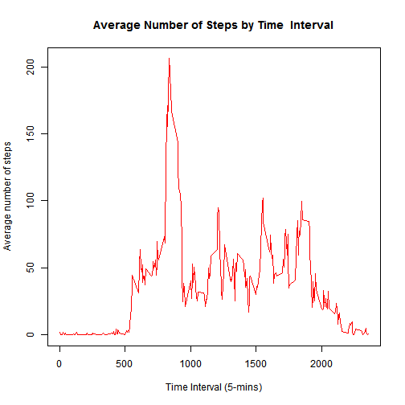
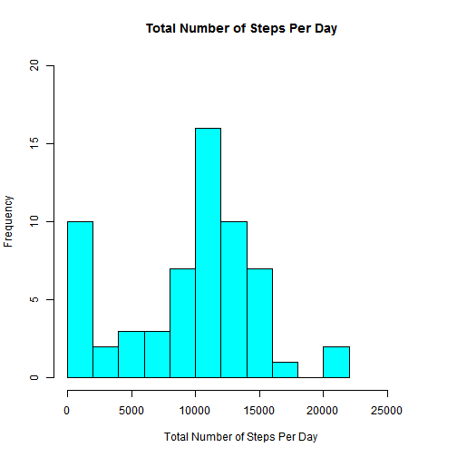
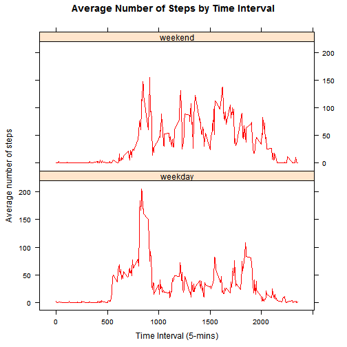

## Introduction

It is now possible to collect a large amount of data about personal movement using activity monitoring devices such as a Fitbit, Nike Fuelband, or Jawbone Up. These type of devices are part of the "quantified self" movement - a group of enthusiasts who take measurements about themselves regularly to improve their health, to find patterns in their behavior, or because they are tech geeks. But these data remain under-utilized both because the raw data are hard to obtain and there is a lack of statistical methods and software for processing and interpreting the data.

This assignment makes use of data from a personal activity monitoring device. This device collects data at 5 minute intervals through out the day. The data consists of two months of data from an anonymous individual collected during the months of October and November, 2012 and include the number of steps taken in 5 minute intervals each day.

The data for this assignment can be downloaded from the course web site:

Dataset: Activity monitoring data (activity.zip)

The variables included in this dataset are:

steps: Number of steps taking in a 5-minute interval (missing values are coded as NA)
date: The date on which the measurement was taken in YYYY-MM-DD format
interval: Identifier for the 5-minute interval in which measurement was taken
The dataset is stored in a comma-separated-value (CSV) file and there are a total of 17,568 observations in this dataset.

## Assignment Goals

1. Load data from activity.csv
2. Process Data
3. Analyze Data and create various plots
4. Using knitr, generate .html and .md file
5. Commit all these changes to github


## Environment and Tools used for this assignment
1. Operating Systsem: Windows 10 Pro
2. RStudio Version 0.99.893 
3. R version 3.2.3

## Initial Setup
1. Assuming that RStudio is launched, make sure that Working Directory is set using setwd() or through RStudio UI 2. Ideally this is where your git repo is located 
3. This will also make sure that all required files can be accessed from RStudio.
4. Output files are also created in this folder

## Variable for Data Sets (quick reference section)

1. activityData     -- Loaded from csv file
2. activityData2    -- NA are removed
3. activityData3    -- Records with NA
4. activityData4    -- Merged Data set
5. activityData5    -- Data set with NA replaced with median values

## Loading of required Libraries

```{}
  library(lattice)
  library(knitr)
```

## 1. Loading and preprocessing the data

1. This the Data Extract step - A variable called "activityData" is declared and data is loaded in this variable using read.csv()


```r
# read.csv() loads all values from .csv as strings into dataset
activityData <-read.csv("activity.csv")
```

2. Check for the summary using summary() function

```r
summary(activityData)
```

```
##      steps                date          interval     
##  Min.   :  0.00   2012-10-01:  288   Min.   :   0.0  
##  1st Qu.:  0.00   2012-10-02:  288   1st Qu.: 588.8  
##  Median :  0.00   2012-10-03:  288   Median :1177.5  
##  Mean   : 37.38   2012-10-04:  288   Mean   :1177.5  
##  3rd Qu.: 12.00   2012-10-05:  288   3rd Qu.:1766.2  
##  Max.   :806.00   2012-10-06:  288   Max.   :2355.0  
##  NA's   :2304     (Other)   :15840
```
4. Check for few records from the data set using head() function

```r
head(activityData)
```

```
##   steps       date interval
## 1    NA 2012-10-01        0
## 2    NA 2012-10-01        5
## 3    NA 2012-10-01       10
## 4    NA 2012-10-01       15
## 5    NA 2012-10-01       20
## 6    NA 2012-10-01       25
```

4. Check for the str

```r
str(activityData)
```

```
## 'data.frame':	17568 obs. of  3 variables:
##  $ steps   : int  NA NA NA NA NA NA NA NA NA NA ...
##  $ date    : Factor w/ 61 levels "2012-10-01","2012-10-02",..: 1 1 1 1 1 1 1 1 1 1 ...
##  $ interval: int  0 5 10 15 20 25 30 35 40 45 ...
```

## 2. Data Processing 

This is where we will apply the required transformations, data cleaning and any additional steps required to keep the data set ready for analysis. 

1. read.csv() reads the values from csv. Initially all values are loaded as strings. It is a good practice to apply relevant data types for easier processing moving forward. 


```r
activityData$date <-as.Date(activityData$date)
activityData$steps <-as.numeric(activityData$steps)
activityData$interval <-as.numeric(activityData$interval)
```

2. This step is to create a seperate data set by filtering out any records with missing values (for example, there are rows with NA values in "steps"" column).


```r
# just take all the records with values. NA values will be ignored (entire record)
activityData2 <- activityData[complete.cases(activityData),]
```

## 3. Performing Data Analysis and trying to answer the questions (presented as part of the assignment)
### Basic rule is to use the most possible tidy data set. Hence we will be using "activityData2"

## What is mean total number of steps taken per day?

1. Calculate the total number of steps taken per day<br>

We can find this by grouping of records by date and "sum" of the steps. Remember we are using the data set,named "activityData2". All the records with NULLS (NA) are already filtered out.


```r
dailySteps <- as.data.frame(tapply( activityData2$steps, 
                                    INDEX = activityData2$date, 
                                    FUN = "sum"))
colnames(dailySteps) <-  "steps"

head(dailySteps)
```

```
##            steps
## 2012-10-02   126
## 2012-10-03 11352
## 2012-10-04 12116
## 2012-10-05 13294
## 2012-10-06 15420
## 2012-10-07 11015
```

```r
tail(dailySteps)
```

```
##            steps
## 2012-11-24 14478
## 2012-11-25 11834
## 2012-11-26 11162
## 2012-11-27 13646
## 2012-11-28 10183
## 2012-11-29  7047
```

2. Make a histogram of the total number of steps taken each day<br>

In order to create the Histogram, we need some additional variables to hold some information for histogram


```r
# We are adding additional 6000 steps so that y-axis line is little longer when histogram is displayed
# Choose the number you are comfortable with. It could be 6000 or 10000

maxDailySteps <- max(dailySteps) + 6000
```
### Plot the Histogram- Frequency of Steps

```r
  hist(dailySteps$steps, main = "Total Number of Steps Per Day", 
      xlab = "Total Number of Steps Per Day", ylab = "Frequency", 
      breaks = 10, xlim = c(0, maxDailySteps), ylim = c(0, 20), col = "green")
```



3. Calculate and report the mean and median of the total number of steps taken per day


```r
  meanSteps <-  mean(dailySteps$steps)
  medianSteps <- median(dailySteps$steps)
  
  # Display Mean and Median Steps
  meanSteps
```

```
## [1] 10766.19
```

```r
  medianSteps
```

```
## [1] 10765
```

## What is the average daily activity pattern?

1. Make a time series plot (i.e. type = "l") of the 5-minute interval (x-axis) and the average number of steps taken, averaged across all days (y-axis)<br>
Let's calculate the mean for steps by interval, using grouping.<br>
### we are using activityData2, in which records with NA values are already removed


```r
meanStepsByInterval <- as.data.frame(tapply(activityData2$steps,INDEX = activityData2$interval, FUN = "mean"))
```


```r
colnames(meanStepsByInterval) <- "mean_steps"
meanStepsByInterval$interval <- rownames(meanStepsByInterval)

# verify first few records
head(meanStepsByInterval)
```

```
##    mean_steps interval
## 0   1.7169811        0
## 5   0.3396226        5
## 10  0.1320755       10
## 15  0.1509434       15
## 20  0.0754717       20
## 25  2.0943396       25
```

Plotting is done using "plot" function with type set to l (line)


```r
plot(meanStepsByInterval$interval, meanStepsByInterval$mean_steps, type = "l", 
    xlab = "Time Interval (5-mins)", ylab = "Average number of steps", 
    main = "Average Number of Steps by Time  Interval", col="red")
```



2. Which 5-minute interval, on average across all the days in the dataset, contains the maximum number of steps?


```r
# Let's calculate the average across all the days

maxMeanStepsByInterval <- meanStepsByInterval[(meanStepsByInterval$steps == max(meanStepsByInterval$steps)), ]
```

```
## Warning in max(meanStepsByInterval$steps): no non-missing arguments to max;
## returning -Inf
```

```r
maxInterval  <- maxMeanStepsByInterval[1, 2]
maxInterval
```

```
## [1] NA
```

## Imputing missing values

1. Calculate and report the total number of missing values in the dataset (i.e. the total number of rows with NAs)


```r
# Rows with missing values (NA)
activityData3 <- activityData[!complete.cases(activityData),] 
rowsWithNullValues <- nrow(activityData3)
rowsWithNullValues
```

```
## [1] 2304
```

2. Devise a strategy for filling in all of the missing values in the dataset. The strategy does not need to be sophisticated. For example, you could use the mean/median for that day, or the mean for that 5-minute interval, etc.


```r
# calculate median number of steps by intervals without missing values.
# I am using activityData2 (which has all the null records removed)

medianStepsByInterval  <- as.data.frame(tapply(activityData2$steps,
                                               INDEX = activityData2$interval,
                                               FUN = "median"))
                                        
#Name calculated median column to median_steps

colnames(medianStepsByInterval) <- "median_steps"

medianStepsByInterval$interval <- rownames(medianStepsByInterval)

row.names(medianStepsByInterval)<-NULL

meanAndmedian <- merge(medianStepsByInterval,meanStepsByInterval, by="interval")

# merge with original data with missing and create a new dataset called activityData4

activityData4 <- merge(activityData,meanAndmedian, by="interval")

# check for head and tail to see the data
head(activityData4)
```

```
##   interval steps       date median_steps mean_steps
## 1        0    NA 2012-10-01            0   1.716981
## 2        0     0 2012-11-23            0   1.716981
## 3        0     0 2012-10-28            0   1.716981
## 4        0     0 2012-11-06            0   1.716981
## 5        0     0 2012-11-24            0   1.716981
## 6        0     0 2012-11-15            0   1.716981
```

```r
tail(activityData4)
```

```
##       interval steps       date median_steps mean_steps
## 17563     2355     0 2012-10-16            0   1.075472
## 17564     2355     0 2012-10-07            0   1.075472
## 17565     2355     0 2012-10-25            0   1.075472
## 17566     2355     0 2012-11-03            0   1.075472
## 17567     2355    NA 2012-10-08            0   1.075472
## 17568     2355    NA 2012-11-30            0   1.075472
```

3. Create a new dataset that is equal to the original dataset but with the missing data filled in.


```r
for (i in (1:nrow(activityData4))) {
    if (is.na(activityData4$steps[i])) {
        activityData4$steps[i] <- activityData4$median_steps[i]
    } 
}


#head(acmDT_with_summ)
activityData5 <- activityData4[, c("steps","date", "interval")]

head(activityData5)
```

```
##   steps       date interval
## 1     0 2012-10-01        0
## 2     0 2012-11-23        0
## 3     0 2012-10-28        0
## 4     0 2012-11-06        0
## 5     0 2012-11-24        0
## 6     0 2012-11-15        0
```

```r
tail(activityData5)
```

```
##       steps       date interval
## 17563     0 2012-10-16     2355
## 17564     0 2012-10-07     2355
## 17565     0 2012-10-25     2355
## 17566     0 2012-11-03     2355
## 17567     0 2012-10-08     2355
## 17568     0 2012-11-30     2355
```

```r
summary(activityData)
```

```
##      steps             date               interval     
##  Min.   :  0.00   Min.   :2012-10-01   Min.   :   0.0  
##  1st Qu.:  0.00   1st Qu.:2012-10-16   1st Qu.: 588.8  
##  Median :  0.00   Median :2012-10-31   Median :1177.5  
##  Mean   : 37.38   Mean   :2012-10-31   Mean   :1177.5  
##  3rd Qu.: 12.00   3rd Qu.:2012-11-15   3rd Qu.:1766.2  
##  Max.   :806.00   Max.   :2012-11-30   Max.   :2355.0  
##  NA's   :2304
```

```r
summary(activityData5)
```

```
##      steps          date               interval     
##  Min.   :  0   Min.   :2012-10-01   Min.   :   0.0  
##  1st Qu.:  0   1st Qu.:2012-10-16   1st Qu.: 588.8  
##  Median :  0   Median :2012-10-31   Median :1177.5  
##  Mean   : 33   Mean   :2012-10-31   Mean   :1177.5  
##  3rd Qu.:  8   3rd Qu.:2012-11-15   3rd Qu.:1766.2  
##  Max.   :806   Max.   :2012-11-30   Max.   :2355.0
```


4. Make a histogram of the total number of steps taken each day and Calculate and report the mean and median total number of steps taken per day. Do these values differ from the estimates from the first part of the assignment? What is the impact of imputing missing data on the estimates of the total daily number of steps?


```r
# This exercise is similar to what we did earlier, but this time we are using
# the data set in which we have replace the NA values with median value

# Number of steps on a particular date
stepsPerDay <- as.data.frame(tapply(activityData5$steps, INDEX = activityData5$date, FUN = "sum"))
colnames(stepsPerDay) <-  "steps"

maxNumberOfSteps <- max(stepsPerDay)+6000

# plot histogram of frequency of the steps
hist(stepsPerDay$steps, main = "Total Number of Steps Per Day", 
    xlab = "Total Number of Steps Per Day", ylab = "Frequency", 
    breaks = 10, xlim = c(0, maxNumberOfSteps), ylim = c(0, 20), col = "cyan")
```



What is the impact of imputing missing data on the estimates of the total daily number of steps?


```r
  meanSteps1 <-  mean(stepsPerDay$steps)
  medianSteps1 <- median(stepsPerDay$steps)
  
  # Display Mean and Median Steps (calculated with activityData5)
  meanSteps1
```

```
## [1] 9503.869
```

```r
  medianSteps1
```

```
## [1] 10395
```

```r
  # Display Mean and Median Steps (calculated with activityData2, only records without any NULLS)
  meanSteps
```

```
## [1] 10766.19
```

```r
  medianSteps
```

```
## [1] 10765
```

    
## Are there differences in activity patterns between weekdays and weekends?


1. Create a new factor variable in the dataset with two levels - "weekday" and "weekend" indicating whether a given date is a weekday or weekend day.


```r
# Logical variable - weekdays: Saturday and Sunday would be TRUE else FALSE
activityData5$weekdays <- grepl("^[Ss]", weekdays(as.Date(activityData5$date)))

for (i in (1:nrow(activityData5))) {
    if (activityData5$weekdays[i] == TRUE) {
        activityData5$week_day_factor[i] <- "weekend"
    } else {
        activityData5$week_day_factor[i] <- "weekday"
    }
}
#Check
head(activityData5)
```

```
##   steps       date interval weekdays week_day_factor
## 1     0 2012-10-01        0    FALSE         weekday
## 2     0 2012-11-23        0    FALSE         weekday
## 3     0 2012-10-28        0     TRUE         weekend
## 4     0 2012-11-06        0    FALSE         weekday
## 5     0 2012-11-24        0     TRUE         weekend
## 6     0 2012-11-15        0    FALSE         weekday
```
2. Make a panel plot containing a time series plot (i.e. type = "l") of the 5-minute interval (x-axis) and the average number of steps taken, averaged across all weekday days or weekend days (y-axis). 


```r
meanStepsPerInterval  <- aggregate(activityData5$steps, 
                                   by = list(activityData5$interval, 
                                   activityData5$week_day_factor), FUN = "mean")

colnames(meanStepsPerInterval) <- c("interval", "weekday", "avg_steps")

sortOrder <- order(as.numeric(meanStepsPerInterval$interval))

meanStepsPerInterval <- meanStepsPerInterval[sortOrder, ]

meanByDayType <- aggregate( activityData5$steps, 
                            by = list( activityData5$week_day_factor), 
                            FUN = "mean")

meanWeekdays <- round(meanByDayType[1, 2], 2)

meanWeekends <- round(meanByDayType[2, 2], 2)

# previous initializing did not work in my environment.Hence second time initializing lattice lib
library(lattice)
xyplot(data = meanStepsPerInterval, 
              avg_steps ~ as.numeric(interval) | as.factor(weekday), 
              type = "l", 
              layout = c(1, 2), 
              col = c("red","green"), 
              main = "Average Number of Steps by Time Interval", 
              xlab = "Time Interval (5-mins)", 
              ylab = "Average number of steps")
```


